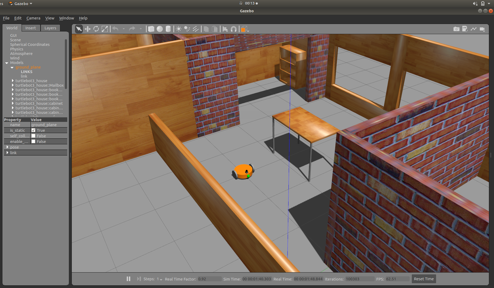
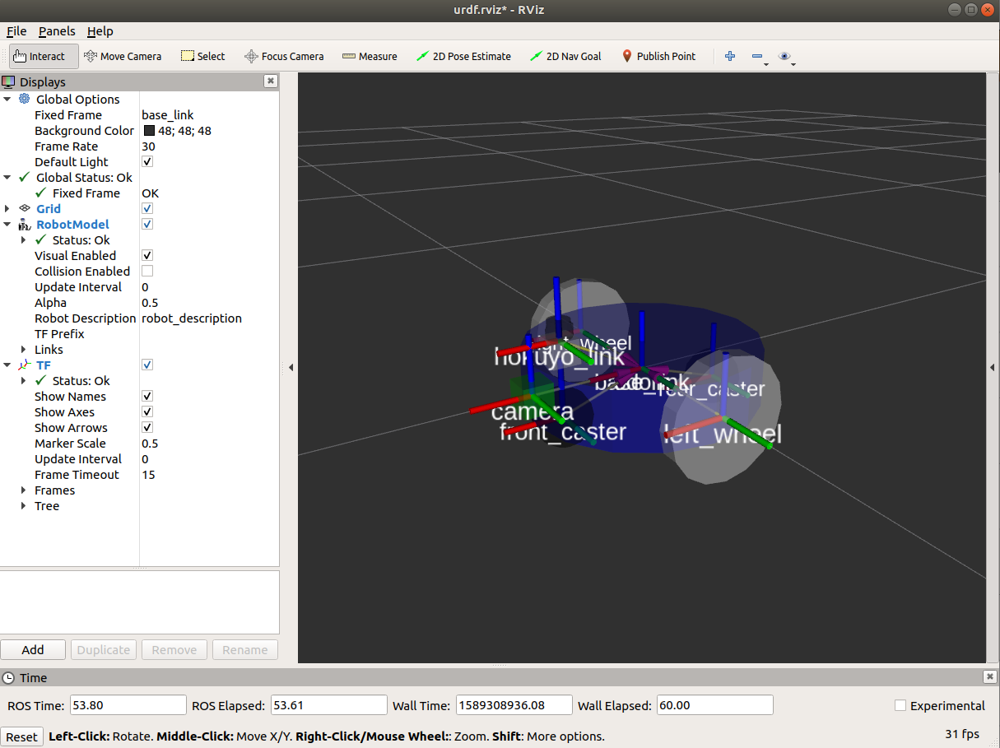
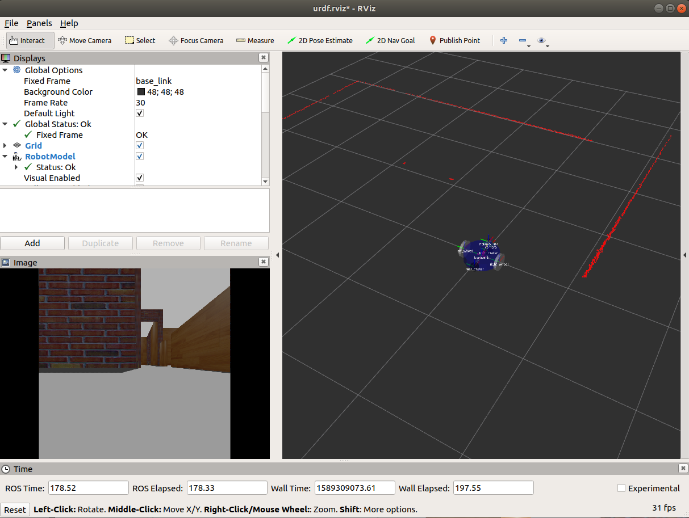

# ros_gazebo_base_model
Hello. This is a simple differential drive robot consists of a LiDAR and a RGB Camera.

You can use this to learn how to use,
 - joint_state_controller
 - diff_drive_controller
 - using macros in urdf
 - adding world files to your gazebo environment 

## Gazebo view

## RViz robot model view

## RViz sensor data

I used world files from [turtlebot3_simulations](https://github.com/ROBOTIS-GIT/turtlebot3_simulations) ros package.
 

